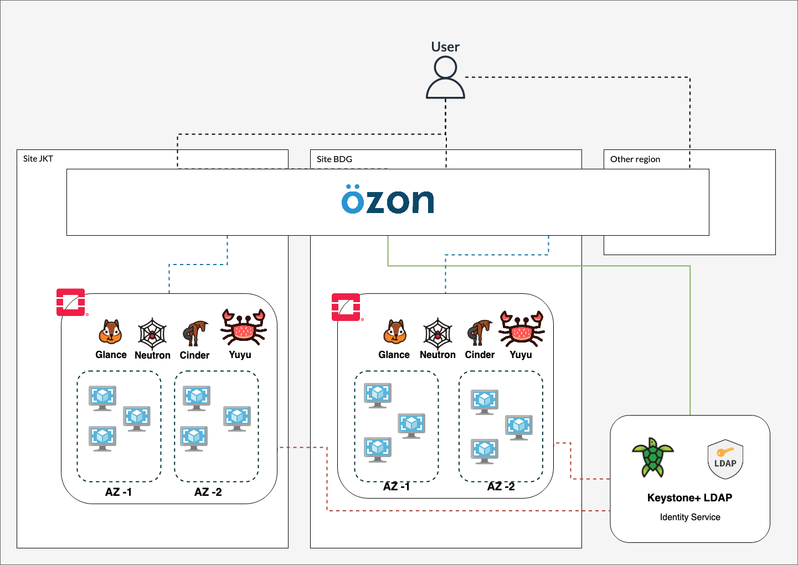

## **Ozon Architecture**

---

## **Ozon Components**
Ozon have tree components for running bellow :

### 1. LDAP

Ozon uses LDAP as a user Authentication service. The OpenStack Keystone service is integrated into LDAP. So just one user for all regions.

### 2. Yuyu

Ozon uses Yuyu as a billing service. Yuyu is able to calculate resource flavors, snapshots, volumes, images, routers floating IPs. For more information about Yuyu, please visit https://yuyu-billing.dev.
