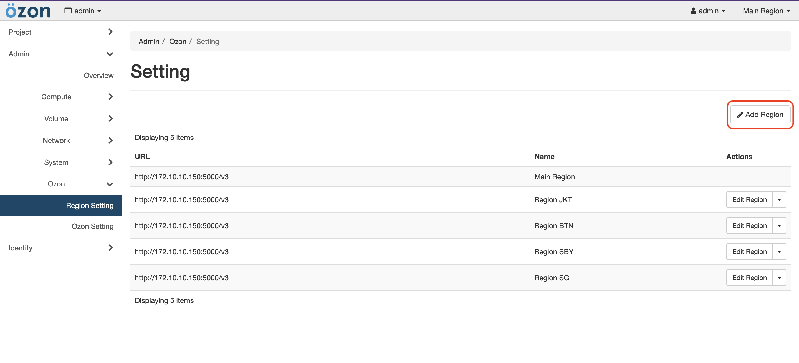
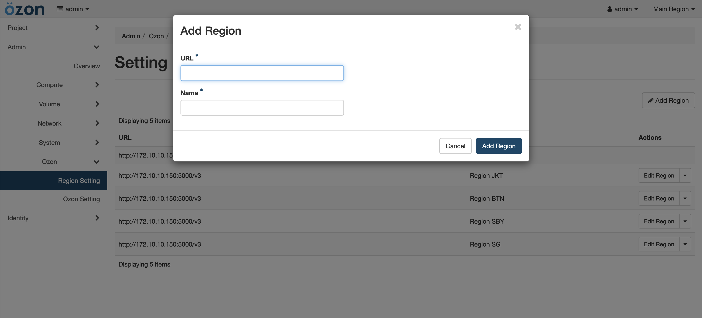
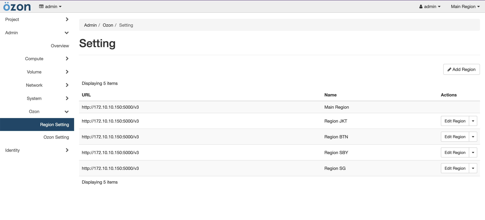
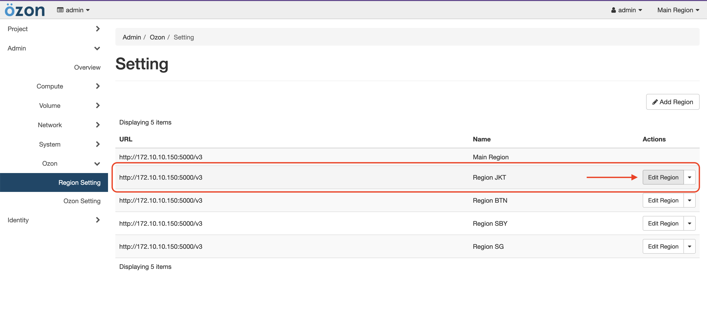
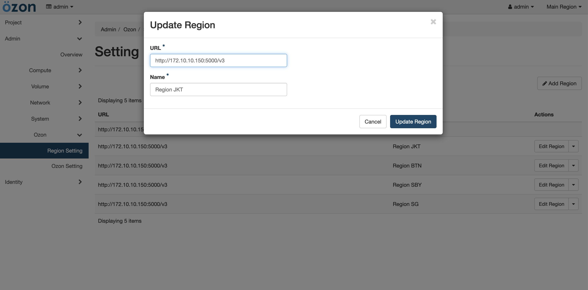
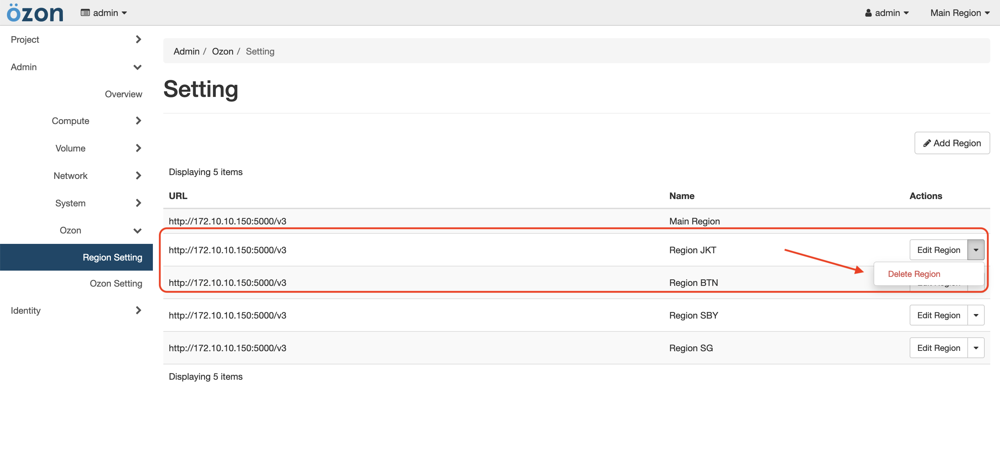
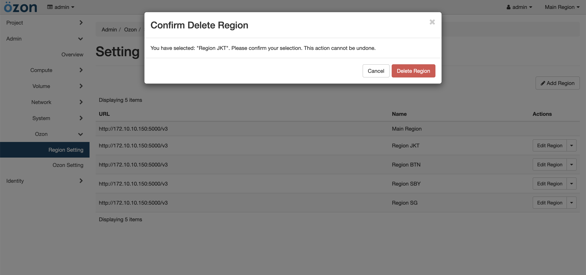

# CRUD Region

In Ozon we can easily Create, Read, Update, Delete (CRUD) region data.  

## Create

- Firstly you need access to admin user, then to `Ozon` menu and click to `Region Setting` and you can click `Add Region` Button.

- After that a popup form will appear. Fill in the `URL` and `Region Name`, then click `Add Region`: 

- And you can see in the table list of region

## Update
- To update the data region, you can click the `Update Region` button on the data row you want.

- After that a popup form will appear. You can change `URL` and `Region Name`, then click `Update Region`:

## Delete
- To delete the data region, you can click dropdown icon the data row you want, then click `Delete Region` button.

- After that a popup confirmation will appear. You can `Delete Region` button to continue process:

