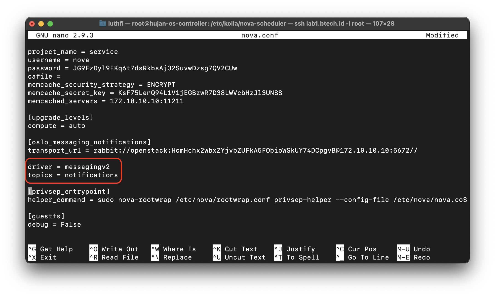
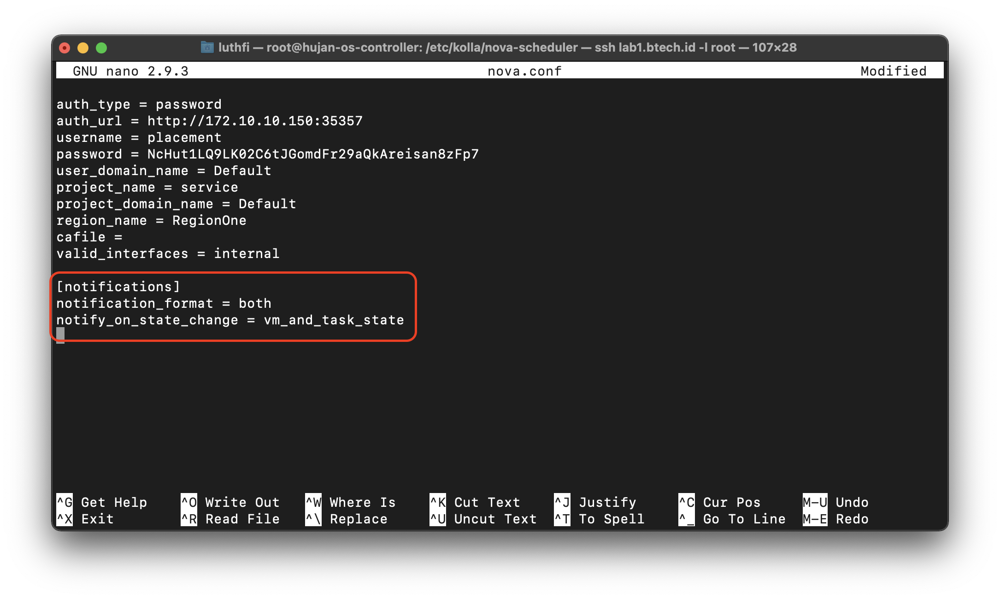
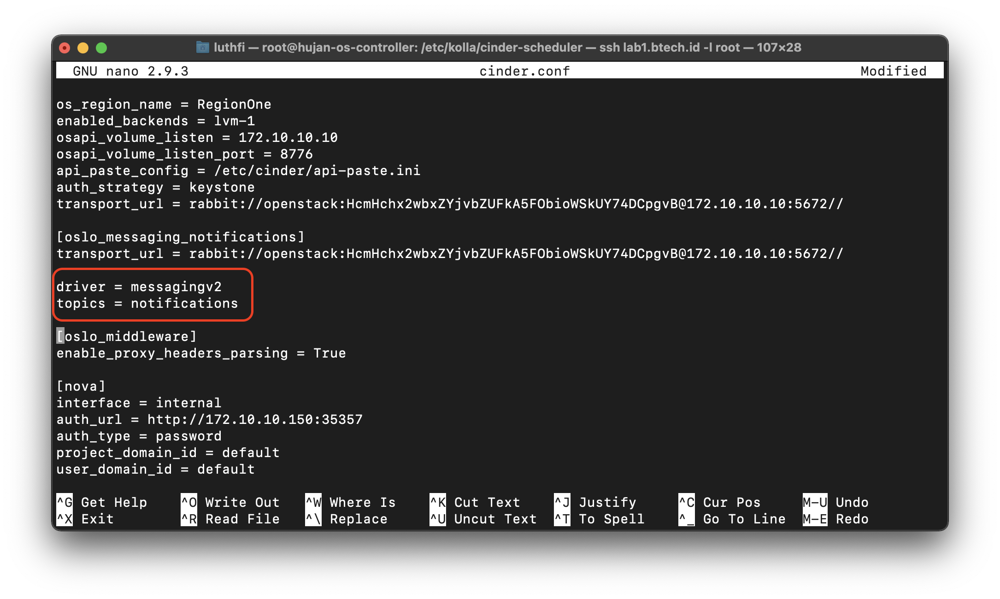
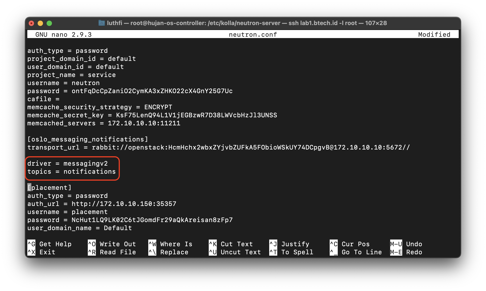

# Pre-Installation
### **Virtualenv**

Make sure you installed virtualenv before installing Ozon

```
pip3 install virtualenv
apt install python3.8
```

### **Openstack Service Notification** 

You need to enable notification for this openstack service if ceilometer and gnochi service **not activated**:

- Nova (nova.conf)
- Cinder (cinder.conf)
- Neutron (neutron.conf)
- Keystone (keystone.conf)

### **1. Nova**


Open `nova.conf` configuration on your controller environment
```
sudo nano nova.conf
```

Add configuration below `oslo_messaging_notifications`

```
driver = messagingv2 
topics = notifications
```



And add configuration below on `notifications`

```
notify_on_state_change = vm_and_task_state
notification_format = unversioned
```




### **2. Cinder**
Open `cinder.conf` configuration on your controller environment

```
sudo nano cinder.conf
```

Add configuration below on `oslo_messaging_notifications`

```
driver = messagingv2 
topics = notifications
```




### **3. Neutron**
Open `neutron.conf` configuration on your controller environment

```
sudo nano neutron.conf
```

Add configuration below on `oslo_messaging_notifications`

```
driver = messagingv2 
topics = notifications
```



### **4. Keystone**
Open `keystone.conf` configuration on your controller environment

```
sudo nano keystone.conf
```

Add configuration below on `oslo_messaging_notifications`

```
driver = messagingv2 
topics = notifications
```


