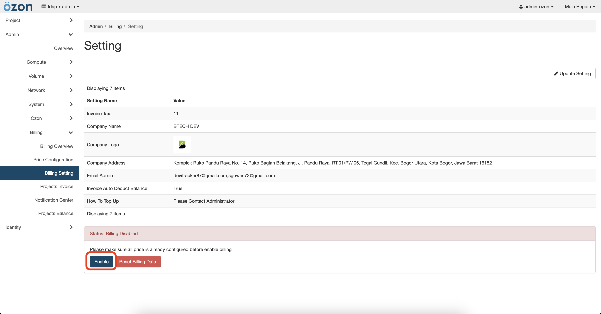

# Pre-Usages

Before ozon calculates your openstack usage, there are a few things to do.

1. Complete price configuration items. If the price configuration is not complete then the system will show a warning and billing cannot be activated. For it we can follow this [**guide**](https://opensource.btech.id/ozon/price/).

2. **Enable billing**. If billing is disabled, ozon never calculate openstack usage. Billing can be enabled if the price configuration is completed. Can set with Tab Admin -> Billing -> Billing Setting & Click Enable 

