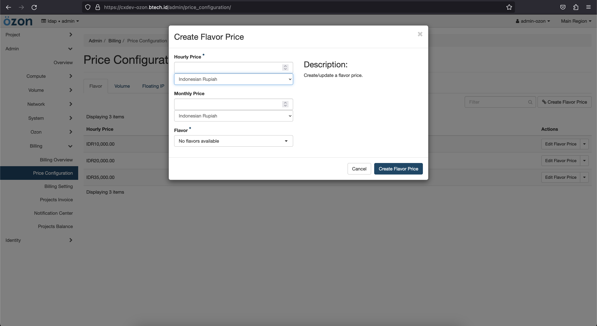

# How to create pricing 

Pricing feature for openstack you can manage bellow detail :

- Flavor
- Volume
- Snapshot
- Floating IP
- Router 
- Images 

## Create price

- Firstly you need access to admin user, then to billing menu and click to `Price Configuration` and you can choose your **feature** for example Flavor pricing.

- Then create your custom pricing for hourly & monthly: 

- And you can see, success to create flavor pricing

