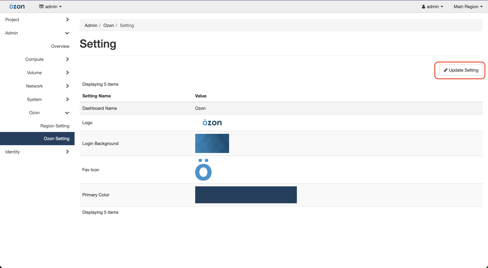
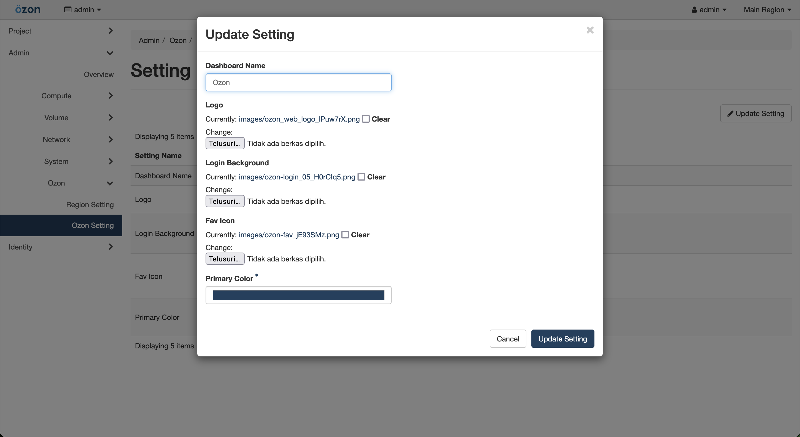

# Theme Setting

In Ozon you can change the color theme, logo identity, login form background, etc. This feature is useful for those of you who want to have a dashboard that matches your company identity.

- Firstly you need access to admin user, then to `Ozon` menu and click to `Ozon Setting`.
- After that you can click `Update Setting` button

- And you can see form update setting to change `Dashboard Name`, `Logo`, `Background Login`, `Favicon`, `Color`

